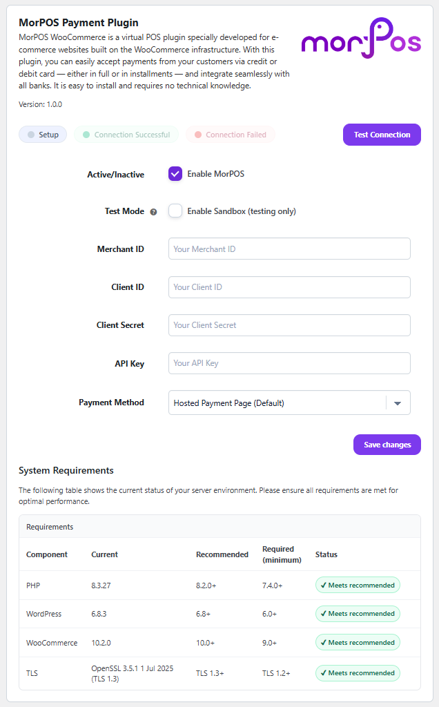

# MorPOS for WooCommerce

[](https://wordpress.org/)
[](https://woocommerce.com/)
[](https://php.net/)
[](LICENSE)

**MorPOS for WooCommerce** is a secure and easy-to-use payment gateway plugin that integrates the **Morpara MorPOS** payment system with WooCommerce stores. Customers are redirected through a secure **Hosted Payment Page (HPP)** flow when completing their orders.


## ✨ Features

- 🛒 **WooCommerce Integration**: Seamlessly adds MorPOS as a payment method 
- 🔒 **Secure Payments**: Hosted Payment Page (HPP) for maximum security
- 🏗️ **WooCommerce Blocks Support**: Compatible with new Cart & Checkout blocks
- 🌍 **Multi-Currency**: Supports TRY, USD, EUR currencies
- 💳 **Multiple Payment Options**: Credit cards, debit cards, and installment payments
- 🧪 **Sandbox Mode**: Test environment for development
- 🔧 **Easy Configuration**: Simple admin panel setup
- 🛡️ **Security Features**: TLS 1.2+ requirement, signed API communication

## 📋 Requirements

### Server Requirements

| Component | Minimum | Recommended |
|-----------|---------|-------------|
| **WordPress** | 6.0 | 6.8+ |
| **WooCommerce** | 7.0 | 10.0+ |
| **PHP** | 7.4 | 8.2+ |
| **TLS** | 1.2 | 1.3 |

### PHP Extensions

- `cURL` - Required for API communication
- `json` - Required for data processing
- `hash` - Required for security signatures
- `openssl` - Required for secure connections

### WordPress Features

- **WooCommerce Plugin**: Must be installed and activated
- **Pretty Permalinks**: Required for payment callbacks
- **SSL Certificate**: Recommended for production environments

## 🚀 Installation

### Method 1: WordPress.org Repository (Recommended)

1. **From WordPress Admin**
   - Go to WordPress admin → **Plugins** → **Add New**
   - Search for "MorPOS for WooCommerce"
   - Click **Install Now** → **Activate**

2. **Via WP-CLI**
   ```bash
   wp plugin install morpos-gateway --activate
   ```

### Method 2: Manual Upload

1. Download the plugin ZIP file from [WordPress.org](https://wordpress.org/plugins/morpos-gateway/)
2. Go to WordPress admin → **Plugins** → **Add New**
3. Click **Upload Plugin** → **Choose File**
4. Select the ZIP file and click **Install Now**
5. Click **Activate Plugin**

### Method 3: Manual Installation (Developers)

1. **Download the Plugin**
   ```bash
   git clone https://github.com/morpara/morpos-woocommerce.git
   ```

2. **Upload to WordPress**
   ```bash
   cp -r morpos-woocommerce/ /path/to/wordpress/wp-content/plugins/morpos-gateway/
   ```

3. **Activate the Plugin**
   - Go to WordPress admin → **Plugins**
   - Find **MorPOS for WooCommerce**
   - Click **Activate**

## ⚙️ Configuration

### 1. Basic Setup

Navigate to **WooCommerce** → **Settings** → **Payments** → **MorPOS**

<div align="center">
  
</div>

### 2. Required Settings

Fill in the following mandatory fields:

| Field | Description | Example |
|-------|-------------|---------|
| **Merchant ID** | Your unique merchant identifier | `12345` |
| **Client ID** | OAuth client identifier | `your_client_id` |
| **Client Secret** | OAuth client secret | `your_client_secret` |
| **API Key** | Authentication key for API requests | `your_api_key` |

### 3. Environment Settings

- **Test Mode**: Enable for development/testing
  - Uses sandbox endpoints
  - No real transactions processed
  - Test card numbers accepted

- **Form Type**: Choose payment interface
  - `Hosted`: Redirect to MorPOS payment page (recommended)
  - `Embedded`: Payment form within your site

### 4. Connection Test

After entering credentials:
1. Click **Test Connection** button
2. Verify green checkmark appears
3. Check system requirements status

## 🛠️ Development & Debugging

### Logging

Enable debug logging by adding to `wp-config.php`:

```php
define('WP_DEBUG', true);
define('WP_DEBUG_LOG', true);
```

Logs will be written to `/wp-content/debug.log`

## 🔍 Troubleshooting

### Common Issues

#### "An error occurred while initiating the payment." Error

This typically indicates configuration issues:

1. **Check Credentials**: Verify all API credentials are correct
2. **Test Connection**: Use the connection test feature
3. **Check Requirements**: Ensure server meets minimum requirements
4. **SSL/TLS**: Verify TLS 1.2+ is supported
5. **Time Sync**: Ensure server time is accurate

#### Payment Not Processing

1. **Currency Support**: Ensure currency is supported (TRY, USD, EUR)
2. **Amount Limits**: Check minimum/maximum transaction limits
3. **Network**: Verify outbound HTTPS connections are allowed
4. **Logs**: Check WordPress debug logs for API errors

#### Checkout Page Issues

1. **Permalinks**: Ensure pretty permalinks are enabled
2. **WooCommerce**: Verify WooCommerce is properly configured
3. **Conflicts**: Temporarily disable other plugins to test
4. **Theme**: Test with default WordPress theme

### System Requirements Check

The plugin includes a built-in system requirements checker accessible from the settings page. It validates:

- ✅ PHP version compatibility
- ✅ TLS version support  
- ✅ Required PHP extensions
- ✅ WordPress version
- ✅ WooCommerce version

### Debug Mode

Enable detailed logging:

```php
// wp-config.php
define('WP_DEBUG', true);
define('WP_DEBUG_LOG', true);

// Check logs at: wp-content/debug.log
```

## 🌐 Internationalization

The plugin supports multiple languages:

- **Turkish (tr_TR)**: Native support
- **English (en_US)**: Default language

### Contributing Translations

**Prerequisites**: WP-CLI must be installed on your system.

#### Installing WP-CLI

If WP-CLI is not installed, follow these steps:

```bash
# Download WP-CLI
curl -O https://raw.githubusercontent.com/wp-cli/wp-cli/v2.8.1/utils/wp-completion.bash

# Make it executable
chmod +x wp-cli.phar

# Move to global location
sudo mv wp-cli.phar /usr/local/bin/wp

# Verify installation
wp --info
```

For detailed installation instructions, visit: [WP-CLI Installation Guide](https://wp-cli.org/#installing)

#### Generating Translation Files

1. Generate POT file:
   ```bash
   wp i18n make-pot . languages/morpos.pot --domain=morpos --include=includes,assets,views
   ```

2. Create JSON translation files:
   ```bash
   wp i18n make-json languages --no-purge
   ```

3. Submit translations via GitHub pull requests

## 🤝 Contributing

We welcome contributions! Here's how to get started:

### Development Setup

1. **Fork the Repository**
   ```bash
   git clone https://github.com/YOUR_USERNAME/morpos-woocommerce.git
   cd morpos-woocommerce
   ```

2. **Set Up Local WordPress**
   - Install WordPress locally
   - Install and activate WooCommerce
   - Copy plugin to `wp-content/plugins/morpos-gateway/`

3. **Make Changes**
   - Follow WordPress coding standards
   - Add appropriate documentation
   - Test with different WordPress/WooCommerce versions

4. **Submit Pull Request**
   - Create feature branch: `git checkout -b feature/your-feature`
   - Commit changes: `git commit -m "Add your feature"`
   - Push branch: `git push origin feature/your-feature`
   - Open pull request on GitHub

### Coding Standards

- Follow [WordPress Coding Standards](https://developer.wordpress.org/coding-standards/)
- Use meaningful variable names and comments
- Test compatibility with supported WordPress/WooCommerce versions
- Include PHPDoc comments for functions and classes

## 📄 License

This project is licensed under the **MIT** License - see the [LICENSE](LICENSE) file for details.

## 🆘 Support

- **Documentation**: Check this README and inline code comments
- **Issues**: [GitHub Issues](https://github.com/morpara/morpos-woocommerce/issues)
- **Community**: [WordPress Support Forum](https://wordpress.org/support/plugin/morpos-gateway/)
- **Contact**: [Morpara Support](https://morpara.com/support)

## 🙏 Acknowledgments

- **WooCommerce Team** - For the excellent e-commerce platform
- **WordPress Community** - For the robust CMS foundation
- **Morpara** - For the secure payment infrastructure

---

**Made with ❤️ by [Morpara](https://morpara.com/)**

For more information about MorPOS payment solutions, visit [morpara.com](https://morpara.com/).